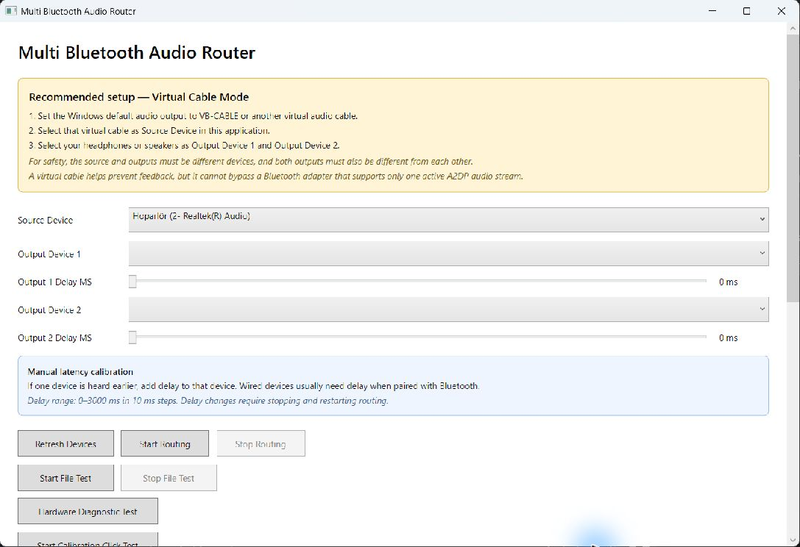

[Türkçe](README.md) | **English**

# Multi Bluetooth Audio Router

[](https://github.com/burhanbty/multi-bluetooth-audio-router/actions/workflows/ci.yml)
[](https://dotnet.microsoft.com/download/dotnet/8.0)
[](LICENSE)

A Windows desktop utility that captures one playback endpoint and routes it to two output endpoints with independent latency compensation. It also includes compatibility preflight checks and structured WASAPI diagnostics for endpoint combinations that Windows or an audio driver refuses to open simultaneously.

> **Project status:** experimental. The routing engine is functional, but results depend on the Bluetooth adapter, audio driver, codecs, and endpoint topology. This application cannot bypass a hardware or driver limit that permits only one active A2DP stream.



## Why this project exists

Windows normally exposes each headset or speaker as an independent audio endpoint. Playing the same source through two endpoints requires separate render pipelines, format conversion, buffering, and explicit delay control. Bluetooth adds another constraint: some adapters and drivers cannot keep two high-quality output streams active at the same time.

This project makes those constraints observable instead of silently failing. It opens endpoints individually and in both orders, classifies common HRESULTs, and reports whether a failure looks device-specific, order-sensitive, format-related, or consistent with a shared resource limit.

## Features

- WASAPI loopback capture from a selected Windows playback endpoint
- Simultaneous rendering to two distinct output endpoints
- Independent 0–3000 ms delay per output in 10 ms steps
- Per-route format conversion through NAudio and Media Foundation
- Common startup prebuffer to reduce initial skew
- Fast compatibility preflight with cached results
- Full endpoint diagnostic in both opening orders
- Symbolic classification for common WASAPI HRESULTs
- File playback and click-track calibration modes
- Live buffer, underflow, and overflow telemetry

## Requirements

- Windows 10 or Windows 11
- [.NET 8 SDK](https://dotnet.microsoft.com/download/dotnet/8.0) to build from source
- Two Windows playback endpoints
- A virtual audio cable is recommended for feedback-safe system-audio routing

## Build and run

```powershell
git clone https://github.com/burhanbty/multi-bluetooth-audio-router.git
cd multi-bluetooth-audio-router
dotnet restore MultiBluetoothAudioRouter.sln --locked-mode
dotnet build MultiBluetoothAudioRouter.sln --configuration Release --no-restore
dotnet run --project MultiBluetoothAudioRouter/MultiBluetoothAudioRouter.csproj --configuration Release
```

Run the deterministic classifier and error-mapping tests with:

```powershell
dotnet run --project MultiBluetoothAudioRouter.Tests/MultiBluetoothAudioRouter.Tests.csproj --configuration Release --no-build
```

## Recommended setup

1. Set Windows' default output to VB-CABLE or another virtual audio cable.
2. Select that virtual endpoint as **Source Device**.
3. Select two different headphones or speakers as the outputs.
4. Run the compatibility preflight before routing.
5. Use the click-track calibration and add delay to whichever output is heard earlier.

The source must differ from both outputs, and the two outputs must differ from each other. This prevents recursive capture and feedback.

## Architecture

The WPF layer coordinates device selection and lifecycle events. Audio work is isolated into routing, per-output session, conversion, diagnostic, and classification components. See [docs/architecture.md](docs/architecture.md) for the component map and failure model.

## Known limitations

- Bluetooth synchronization is approximate; independent devices do not share a hardware clock and may drift.
- Classic Bluetooth adapters commonly impose simultaneous A2DP constraints that software cannot override.
- Transport detection uses Windows endpoint metadata and falls back to name-based heuristics when metadata is incomplete.
- Delay changes are applied when a route starts; active routes must be restarted.
- The current build is Windows-only because it uses WPF, WASAPI, and Media Foundation.

## Privacy

Audio stays on the local machine. The application has no analytics, network client, account system, or cloud upload path. Diagnostic reports can include local endpoint names and device identifiers; review them before sharing publicly.

## Contributing

Bug reports should include the Windows version, adapter/driver details, endpoint types, the selected opening order, and a redacted diagnostic report. See [CONTRIBUTING.md](CONTRIBUTING.md) before submitting changes.

## License

Released under the [MIT License](LICENSE).
