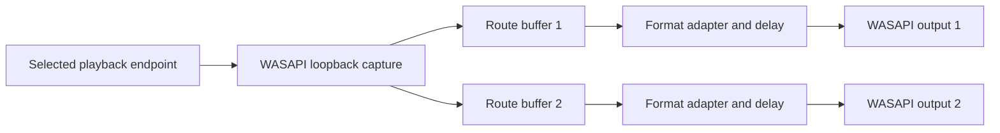

# Architecture

## Data flow

The capture stream is copied into independent bounded buffers. Each output route owns its format conversion chain, manual delay, renderer, and telemetry. A shared startup prebuffer is filled before both renderers begin consuming so the initial skew is bounded by scheduler and driver behavior rather than sequential initialization time alone.

## Components

| Component | Responsibility |
| --- | --- |
| `AudioRoutingEngine` | Owns capture lifecycle, route startup/rollback, state transitions, and fan-out. |
| `OutputRouteSession` | Owns one output renderer, buffer, format chain, delay, and playback events. |
| `RouteAudioBuffer` | Provides bounded buffering and underflow/overflow metrics. |
| `OutputProviderChain` | Adapts the capture format to an endpoint's Windows mix format. |
| `RoutingCompatibilityService` | Runs low-latency endpoint checks and caches results by selection/version. |
| `HardwareDiagnosticService` | Exercises endpoints individually and in both opening orders. |
| `RoutingCompatibilityClassifier` | Converts deterministic attempt results into a user-facing failure class. |
| `AudioErrorClassifier` | Maps known WASAPI HRESULT values and exception chains. |
| `AudioDeviceInspector` | Reads endpoint metadata and makes explicitly marked transport inferences. |

## Failure model

Endpoint failures are not reduced to a generic exception message. Diagnostics preserve:

- the operation that failed (`CreateOutput`, `Initialize`, `Play`, or hold-open);
- the endpoint position and opening order;
- the HRESULT, symbolic name, and normalized failure category;
- whether format conversion failed before renderer initialization;
- the nested exception chain.

The classifier is deterministic, while conclusions about physical Bluetooth limits are deliberately labeled probabilistic. Windows endpoint metadata does not prove which radio or transport is active at runtime.

## Lifecycle guarantees

- Only one routing startup or stop transition runs at a time.
- Startup cancellation rolls back every renderer opened during the attempt.
- Source and output endpoint identities are validated before capture begins.
- Playback failures schedule cleanup outside the NAudio callback path.
- Device refresh invalidates cached compatibility results.

## Testing boundary

Pure classification and HRESULT mapping are covered by automated tests. Hardware-dependent WASAPI behavior requires real endpoints and is intentionally verified through the in-app diagnostic workflow rather than mocked as if it were deterministic.
